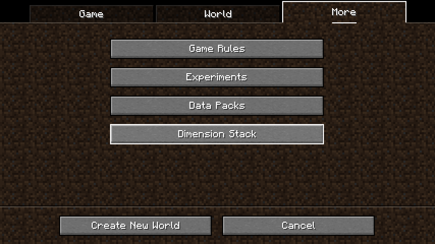
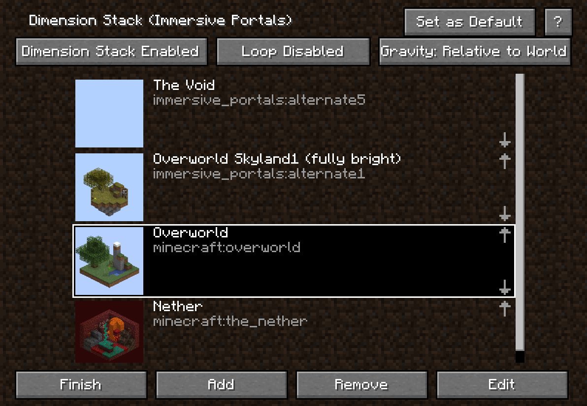
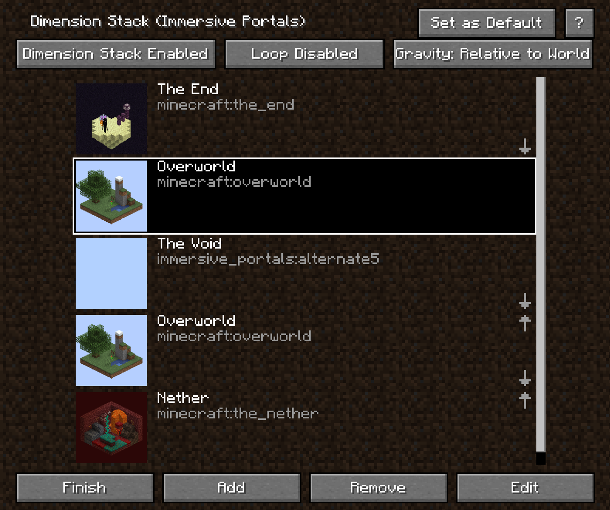
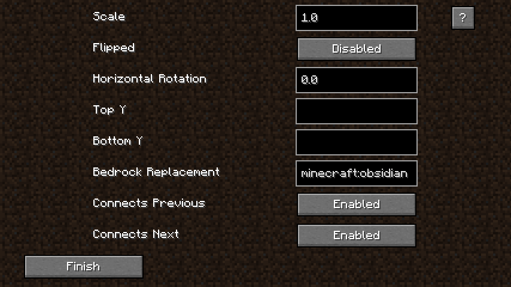

# Dimension Stack

Use [vertical connecting portals](./Portals#vertical-dimension-connecting-portal) to "stack" the dimensions.

When creating a new world, you can see the "Dimension Stack" button in the "More" tab.

(Dimension stack can also be configured in world using command `/portal dimension_stack`.)

Each arrow on the right indicates a connection (a portal). An arrow pointing up means a connection to the previous dimension. You can disable a specific portal by clicking "Edit" then disable "Connects Previous" or "Connects Next".

A dimension can appear multiple times in the list. For example:

In this example, the overworld appears twice. In this case, the end's floor will have a one-way portal that points to overworld. At the same time, the void, overworld and the nether are stacked normally.

One dimension cannot hold two connections on its floor. Same for ceiling. If such conflict exists, the arrow will be in red.

### Per-Dimension Options

By clicking "Edit" you can edit the selected dimension entry's options:

#### Connects Previous, Connects Next

By disabling it, a specific portal will be removed from the dimension stack.

#### Scale

This controls the generated portals' scale transformation. The generated connecting portal won't change the crossing entity's scale.

If you want that one block in nether corresponds to 8 blocks in overworld, set the overworld's scale to 8.

It's recommended to either **(1)** set the scale between overworld and nether to be 8 or **(2)** set the nether portal mode to be `disabled`. Because dimension stack does not interfere with how nether portals work, if dimension stack allows player to travel between overworld and nether with 1 by 1 space ratio, and nether portal allows travelling with 1 by 8 space ratio, then the player can easily reach the world border by using two travel methods alternately.

#### Flipped

Controls the portals' rotating transformation. If enabled, makes the dimension looks "flipped". Does not change the gravity direction in that dimension (unless you enable gravity change option). If a flipped dimension connects to a non-flipped dimension, the connecting portal will have a 180 degrees rotation transformation along X axis.

#### Horizontal Rotation

Controls the portals' rotating transformation. Make the dimension looks rotated along Y axis.

#### TopY, BottomY

Specify the bottom and top Y level of the portal. You can left these two empty by default.

If Bottom Y is left empty, it will use the dimension type's `min_y` property. If Top Y is left empty, it will use the dimension type's `min_y` + `logical_height`.

#### Bedrock Replacement

Specify a block that the bedrock will be replaced into. If empty, the bedrock will not be replaced.

### Main Options

#### Loop

If enabled, the bottom dimension will connect to the top dimension, creating a vertical world wrapping.

#### Gravity

If no dimension is flipped, this option will have no effect. The gravity changing functionality requires Gravity Changer (Gravity API) mod.

This option can be either "Relative to World" or "Relative to View".

1. If it's relative to world, the dimension connecting portal won't change your gravity. When entering a flipped dimension, your gravity relative to the world will not change **but the "viewing gravity" will change** and a rotation animation may perform. If your gravity is downwards before, then after going into a flipped dimension your gravity will still be the same as the direction that water and lava flows down.

2. If it's relative to view, the dimension connecting portal will change your gravity. **The "viewing gravity" will not change** and it will not perform rotation animation. For example, if your gravity is downwards before, entering a flipped dimension will make your gravity upwards, which is the opposite of the direction that water and lava flows down, but you will see no "view rotation".

### Re-configure Dimension Stack Using the Command

This mod has command `/portal dimension_stack` (since MC 1.18) that allows re-configuring dimension stack when the world was already created.

### How to Use Dimension Stack on a Server

The first method: create a dimension stack world on client and then copy it to the server.

The second method: use command `/portal dimension_stack` to enable dimension stack on the server and manually replace existing bedrock blocks into obsidian.

