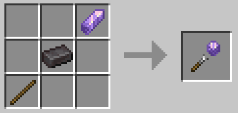
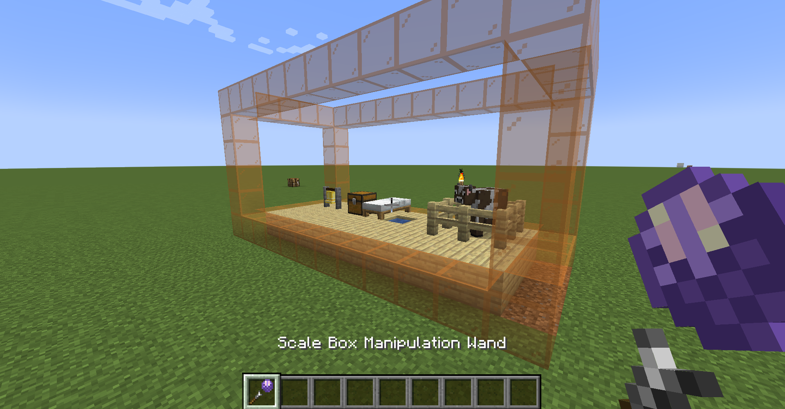
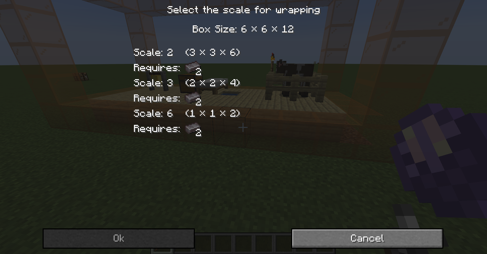
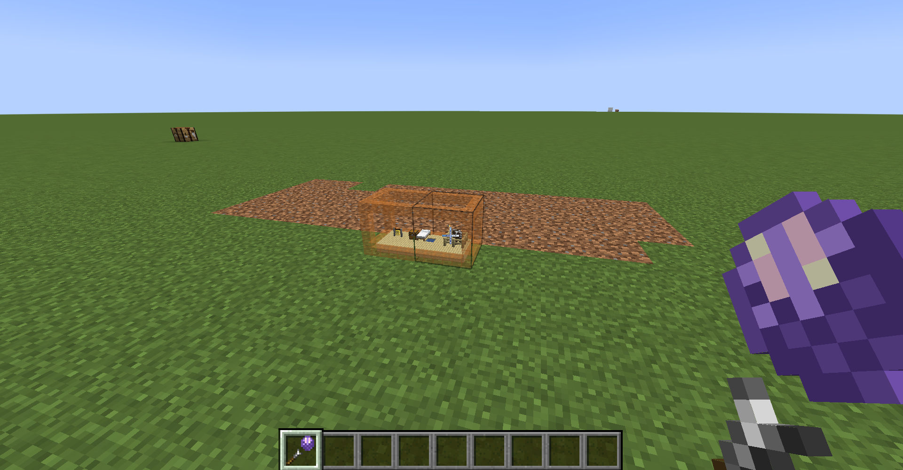
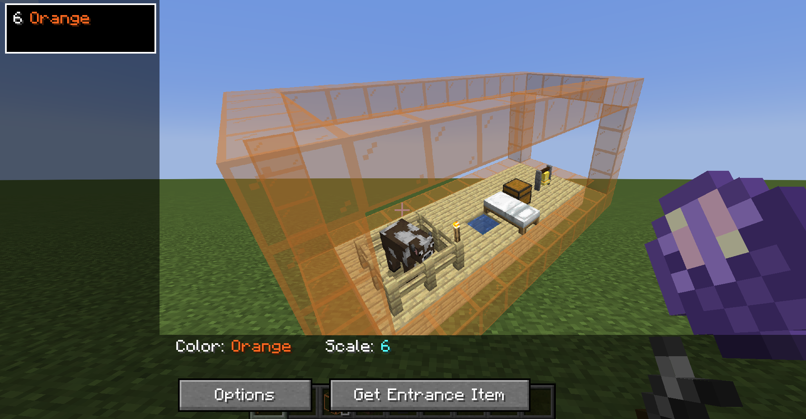
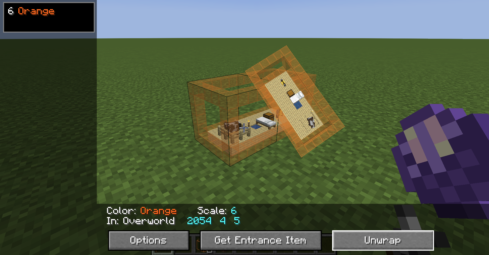
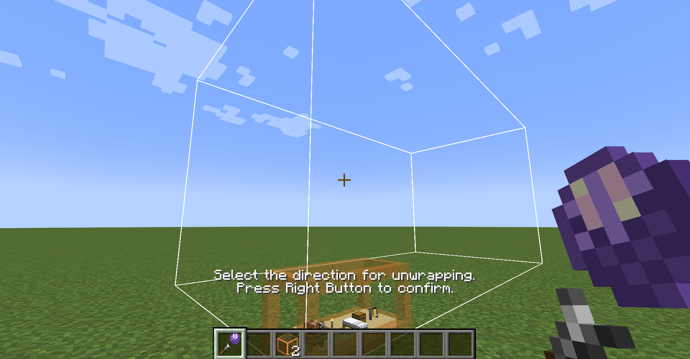

# MiniScaled

MiniScaled is a Fabric mod that provides easy-usable scale boxes using Immersive Portals functionality. You can enter the scale box seamlessly without loading screen. [GitHub](https://github.com/qouteall/MiniScaledMod)

[Download Below](#download)

[Download from CurseForge](https://www.curseforge.com/minecraft/mc-mods/miniscaled)

[Download from Modrinth](https://modrinth.com/mod/miniscaled)

## How to Use

In version 4.0.0 (MC version 1.20.4), this mod has been greatly overhauled. The way of obtaining scale box changed. Now allows wrapping and unwrapping a region. The scale is no longer limited to 4, 6, 32 and 64. The scale now can be any integer from 3 to 64. Also added the GUI for viewing your boxes.

This describes the latest version of the mod. For mod version 3.0.0, see the bottom of the page.

### Manipulation wand

The scale box manipulation wand can be crafted:

The wand is also in creative mode inventory.

### Wrap

Then, choose a box region that you want to wrap into scale box. Use one kind of **stained glass** to build the frame of that region.

The region's size must be divisible to the scale. For example, a 6×6×12 region can scale down by 2, 3 or 6. A 7×8×9 box cannot scale down by an integer.

Use the wand to right-click on that glass frame, a GUI will show. You can choose the scale that you want.

Click "Ok", then the box will be wrapped with animation.

You can break the scale box into item and put it to other places.

### Placing the Scale Box with Rotation

The scale box can be placed with rotations:

When placing the scale box, the face that you are placing on and your position will determine its rotation.

### Manage

Using the manipulation wand to right-click on air opens the scale box management GUI. You can see your scale boxes here:

In that view, change perspective by moving mouse and zoom in/out using mouse wheel.

If you lose the entrance item, by clicking "Get Entrance Item" you can get a new entrance item for free.

In "Options", these settings can be changed for the box:

* Enable scale transform. Controls whether the portal transforms the scale. The scale transform requires Pehkui mod. [See Spacial Transformation](./Spatial-Transformation.html).
* Enable gravity transform. Controls whether the portal transforms gravity. The gravity transform requires Gravity Changer mod. [See Spacial Transformation](./Spatial-Transformation.html).
* Enable access control. If enabled, only the box owner can enter the box. Other players and non-player entities cannot enter the box. Other players cannot do cross-box block interaction. Note: this does not  stop other players from going into the box by other ways, such as respawning.

### Unwrap

By using manipulation wand to right-click on a scale box, an extra "Unwrap" button will appear.

In unwrap mode, a white frame indicates the unwrapped region. Right-click to confirm unwrapping. Then the content inside scale box will be unwrapped to outer world, with an animation.

After unwrapping, the old entrance cannot be placed.

### How the Entrance Works

The actual scale box is in another dimension (`mini_scaled:void`).

The scale box entrance item is just an entrance and does not hold the actual scale box. If you lose your entrance item, you can get another one via the manipulation wand.

One scale box can have only one entrance placed (because the portal is bi-way). If two entrances of one scale box are placed, the old entrance will break.

### Access the Blocks inside Box from Outside

When you are close to the scale box, you can directly place and break blocks inside the scale box.

If you want to break the entrance, you have to be a little bit further to interact with the placeholder block.

When using the scale box manipulation wand, you can break the scale box entrance when close to it.

### Other Tips

You can put a scale box inside itself and create a fractal.

When you are standing on the top of a scale box, crouch(press shift) to descend.

By renaming an entrance item and then placing it, the scale box will be renamed. The new name will be visible in the scale box management GUI.

### Config

You can access the config by mod menu or directly edit `config/mini_scaled.json`. You can specify another item (other than netherite) as the scale box creation item.

### Commands

These commands require level 2 permission.

* `/miniscaled view_all_boxes` Opens the management GUI that shows all scale boxes of all players. 
* `/miniscaled view_my_boxes` Opens the management GUI that shows your boxes. Same as using the manipulation wand.
* `/miniscaled make_frame <block> <x1> <y1> <z1> <x2> <y2> <z2>` Creates a frame using the block.

## Download

Download from GitHub releases:

<ClientOnly>
<ModDownload
    github_repo="iPortalTeam/MiniScaledMod"
    :locale_text="{download:'Download', preRelease:'Pre-Release', publishTime:'Publish time'}"></ModDownload></ClientOnly>

## Description of old versions

::: details For mod version 3.0.0 (MC version 1.20.1)

In survival mode, you can build a block frame using stained glass:  (The frame must be either 4x4x4 or 8x8x8 or 16x16x16 or 32x32x32.)

Then use a netherite ingot to right-click it, you will get a **scale box entrance** item and a **manipulation wand**. You can place the scale box entrance down.

In creative mode, you can get scale box entrances and the scale box manipulation wand in the "Tools & Utilities" tab:

### The Manipulation Wand

When creating an entrance, you will be also given a scale box manipulation wand. By using the wand to right-click on air, its mode will be switched. It has 5 modes:

* None (default mode, no functionality)
* Expand
* Shrink
* Toggle gravity change
* Toggle scale change
* Toggle access control

### Expanding and Shrinking the Scale Box

The scale box can be expanded and shrunk.

There are two ways to expand a scale box. The first way is to use the manipulation wand in "expand" mode. The second way is to use the entrance item to right-click scale box placeholder.

In survival mode, expanding it cosumes entrance items. However, an expanded scale box still correspond to one entrance item.

You can also shrink the scale box. The first way is to use the manipulation wand in "shrink" mode. The second way is to use bare hand to right-click the scale box placeholder.

In survival mode, by shrinking the scale box, an amount of netherite ingots will be returned.

It can only expand and shrink from some directions. These directions are the directions that correspond to the inner up, south and east. Why is there such a limitation? Because if you expand it from south and then shrink it from north, the inner region should move in space. It could move out of height limit or move to the region of other scale boxes, so it's not allowed. 

### Scale and Gravity Transformation

You can use the manipulation wand to change whether the scale box transforms scale and gravity during teleportation. The scale change requires Pehkui mod. The gravity change requires Gravity API mod. [See Spacial Transformation](./Spatial-Transformation.html).

:::