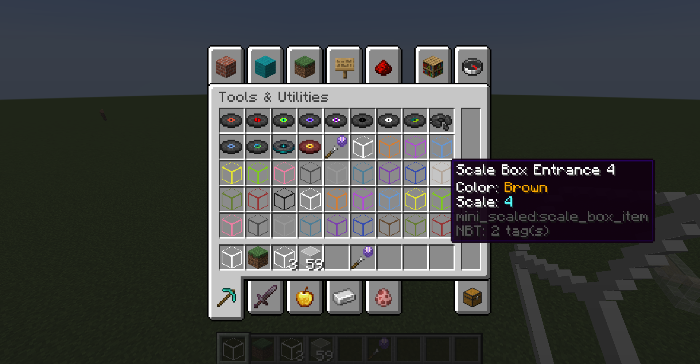
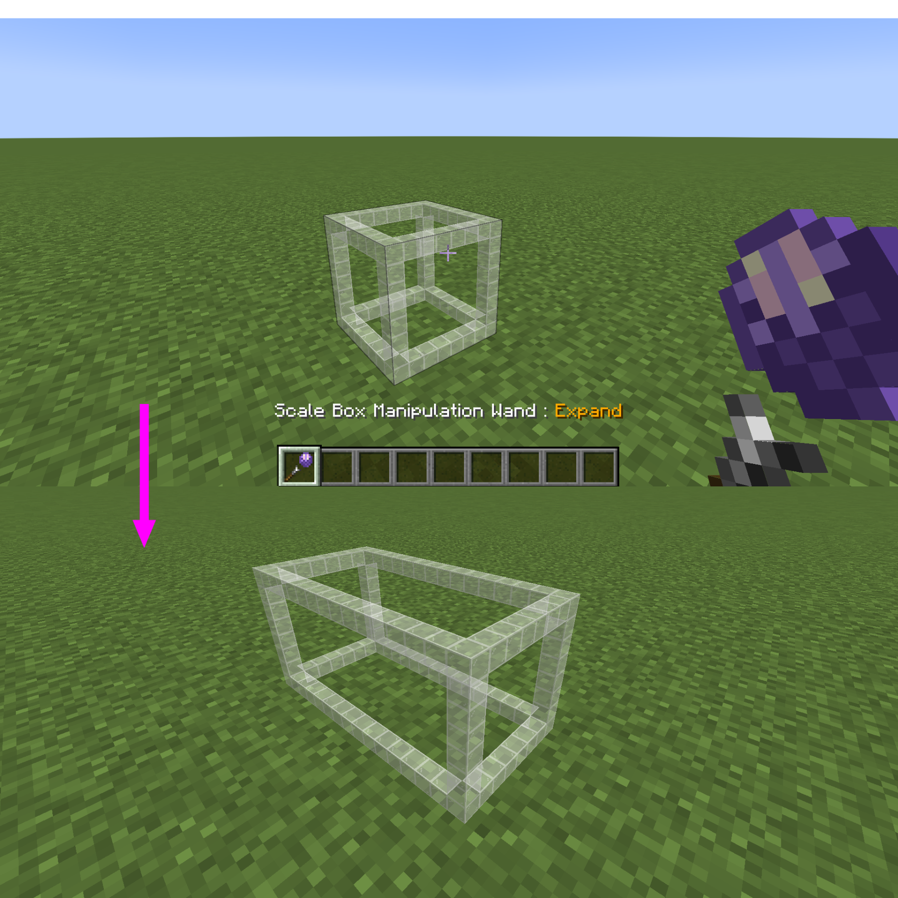
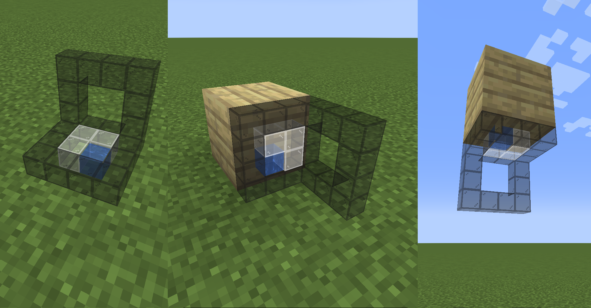

# MiniScaled

MiniScaled is a Fabric mod that provides easy-usable scale boxes using Immersive Portals functionality. You can enter the scale box seamlessly without loading screen. [GitHub](https://github.com/qouteall/MiniScaledMod)

[Download Below](#download)

[Download from CurseForge](https://www.curseforge.com/minecraft/mc-mods/miniscaled)

## How to Use

(This describes the latest version of MiniScaled)

In survival mode, you can build a block frame using stained glass:  (The frame must be either 4x4x4 or 8x8x8 or 16x16x16 or 32x32x32.)

Then use a netherite ingot to right-click it, you will get a **scale box entrance** item and a **manipulation wand**. You can place the scale box entrance down.

In creative mode, you can get scale box entrances and the scale box manipulation wand in the "Tools & Utilities" tab:

### How the Entrance Works

The actual scale box is in another dimension (`mini_scaled:void`). The scale boxes are discriminated by its color, size and owner. (You can enter a scale box owned by other players.)

The scale box entrance item is just an entrance and does not hold the actual scale box. If you lose your entrance item, you can create another entrance with the same size and color.

One scale box can have only one entrance placed (because the portal is bi-way). If two entrances of one scale box are placed, the old entrance will break.

### Access the Blocks inside Box from Outside

When you are close to the scale box, you can directly place and break blocks inside the scale box.

If you want to break the entrance, you have to be a little bit further to interact with the placeholder block.

When using the scale box manipulation wand, you can break the scale box entrance when close to it.

### The Manipulation Wand

When creating an entrance, you will be also given a scale box manipulation wand. By using the wand to right-click on air, its mode will be switched. It has 5 modes:

* None (default mode, no functionality)
* Expand
* Shrink
* Toggle gravity change
* Toggle scale change

### Expanding and Shrinking the Scale Box

The scale box can be expanded and shrunk.

There are two ways to expand a scale box. The first way is to use the manipulation wand in "expand" mode. The second way is to use the entrance item to right-click scale box placeholder.

In survival mode, expanding it cosumes entrance items. However, an expanded scale box still correspond to one entrance item.

You can also shrink the scale box. The first way is to use the manipulation wand in "shrink" mode. The second way is to use bare hand to right-click the scale box placeholder.

In survival mode, by shrinking the scale box, an amount of netherite ingots will be returned.

It can only expand and shrink from some directions. These directions are the directions that correspond to the inner up, south and east. Why is there such a limitation? Because if you expand it from south and then shrink it from north, the inner region should move in space. It could move out of height limit or move to the region of other scale boxes, so it's not allowed. 

### Placing the Scale Box with Rotation

You can place a scale box with rotations:

When placing the scale box, the face that you are placing on and your position will determine its rotation.

### Scale and Gravity Transformation

You can use the manipulation wand to change whether the scale box transforms scale and gravity during teleportation. The scale change requires Pehkui mod. The gravity change requires Gravity API mod. [See Spacial Transformation](./Spatial-Transformation.html).

### Other Tips

You can put a scale box inside itself and create a fractal.

When you are standing on the top of a scale box, crouch(press shift) to descend.

### Config

You can access the config by mod menu or directly edit `config/mini_scaled.json`. You can specify another item (other than netherite) as the scale box creation item.

## Download

Download from GitHub releases:

<ClientOnly>
<ModDownload
    github_repo="iPortalTeam/MiniScaledMod"
    :locale_text="{download:'Download', preRelease:'Pre-Release', publishTime:'Publish time'}"></ModDownload></ClientOnly>