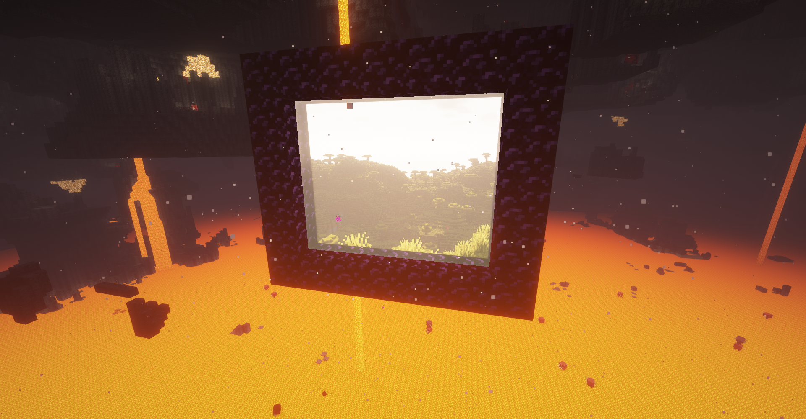

# Miscellaneous

### Text Translation

You can [contribute text translation on Crowdin](https://crowdin.com/project/immersive-portals-mod). Thanks to the translation contributors.

If you want to add another language, please contact qouteall.

### Iris Shader Compatibility

Immersive Portals mod roughly works with some Iris shaderpacks. Not all shaderpacks are compatible (Sildurs Vibrant shader and path tracing shaders are incompatible).

It's recommended to turn off settings such as TAA, Anti-Aliasing and Motion Blur in the shaderpack's settings.

The portal rendering with shader **is not perfect because of technical difficulties. The Iris/OptiFine shaderpack standard is not designed to work with portal rendering. I already tried hard to hack the shader rendering process to make it work with portals.**

Following things cannot be correctly rendered with shaders:

* Semi-transparent things (e.g. stained glass) in front of the portal.  (Due to that, all mirrors will cover the glass texture with shaders on)
* Portal overlay
* Fuse-view portals
* Cross portal entity rendering
* Temporal Anti Aliasing (TAA) when a portal is in view
* Motion Blur when a portal is in view
* World Curvature with portals

Other than that, effects like rain distortion will be abnormal with portals. And the portal rendering with shader does not work on some ancient videocards.

As I tested, BSL shader works mostly fine with Immersive Portals.

### Could a Server with This Mod Work with Vanilla Client?

No. Because

* Networking protocol differences. This mod allows the client to load multiple dimensions at the same time, while vanilla only allow one dimension to be loaded at the same time. The vanilla networking packets does not discriminate between different dimensions, so Immersive Portals change the networking protocol to discriminate between dimensions. (It's theoretically possible to automatically adjust to networking protocol differences, but it would be very complex and error-prone so it's not worth the effort)
* This mod's portals are more flexible than vanilla. This mod's portal can be in any shape and can be tilted. Vanilla portal blocks cannot represent that.

### Could a Client with This Mod Work with Vanilla Server?

A client with this mod should be able to join a vanilla server (if not, report the issue).

However, if the server does not have this mod, then the server does not send chunk data in remote dimension to client, so client cannot render the see-through portal.

### Could a Portal Link to Another Server?

No. Inter-server portals require sending packets across servers, cross-server visibility check, a cross-server dimension id system, and entity transfer between servers. It's very hard to implement.

### OptiFine Compatibility

In MC 1.18 and above, this mod is incompatible with OptiFine. Because OptiFine is not open-source, debugging with OptiFine is very hard. It's recommended to use Sodium and Iris. [Check this](https://lambdaurora.dev/optifine_alternatives/)

In older MC versions, this mod is problematic with OptiFine so it's not recommended to use this mod with OptiFine.

### What Happens if I Remove ImmPtl?

All see-through portals will vanish. Even if you re-install ImmPtl, the portals cannot recover. (Portals in unloaded chunks may remain.)

Vanilla nether/end portals still exist. Dimension stack bedrock replacement will not work.

 ### Can Fluid, Redstone and Light Work Across a Portal?

No. This mod's portal supports scaling and rotation transformation. The portal can be in anywhere and be in any orientation. It's hard to imagine how redstone signal transfers when the blocks are not aligned.

But you can use entities to carry signals through a portal. For example, an item dispenser on one side and a hopper on the other side.

Although it's possible to implement cross portal redstone and fluid when the portal is aligned with blocks, it would be very hard to implement. And cross-portal redstone machines won't be stable because of the chunk loading delay.

About lighting: The nether portals by default has glowstone-level lighting. For custom portals, you can put lights behind the portal to make it looks seamless.

### Upgrade a World that Have Immersive Portals Things

For example if you have a world in MC 1.15.2 that contains immersive portals, and then you want to upgrade the world to 1.18.2, then you need to firstly upgrade to 1.16.5 then 1.17.1 then 1.18.2. Otherwise the portals may get lost.

### The website source

[This wiki on GitHub](https://github.com/qouteall/immptl)

Fell free to create a PR if you want to suggest changes.
