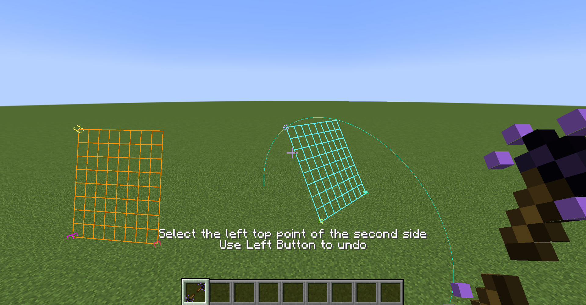
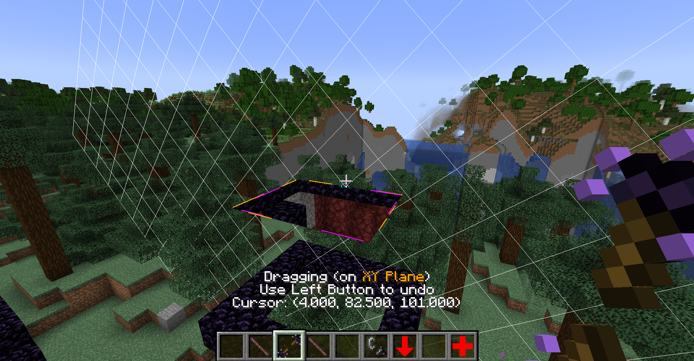
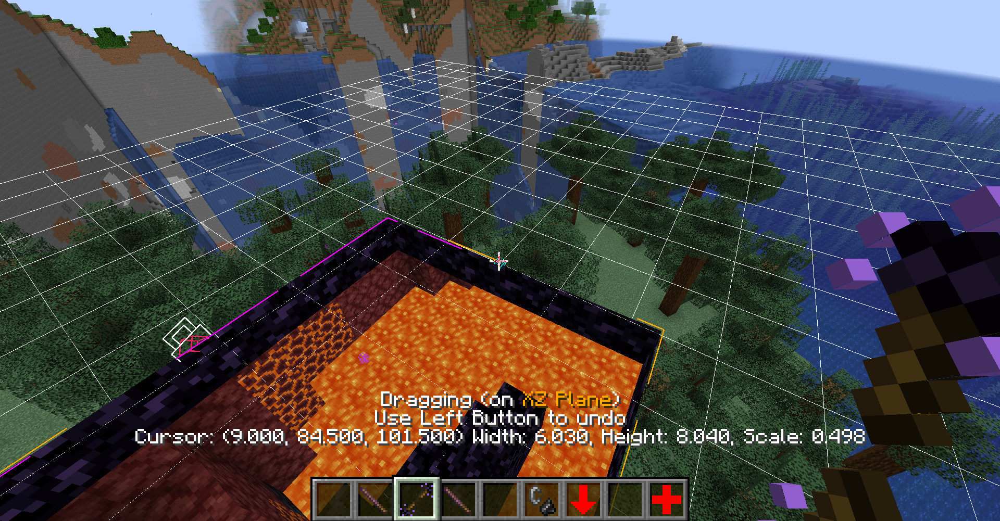
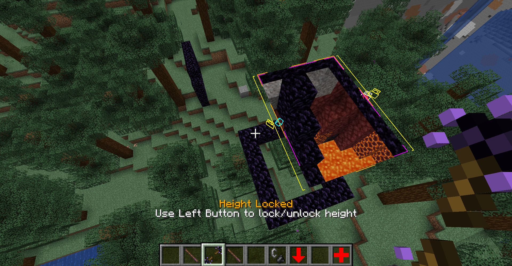

# Portal Customization

## Portal Wand

The portal wand is a tool for easily creating and editing portals in creative mode. You can find the portal wand in "Tools & Utilities" tab.

The portal wand has 3 modes: Create Portal, Drag Portal and Copy Portal. Pressing shift and right-click at the same time to switch mode. Use shift + left-click to show portal wand settings and change cursor alignment.

> Portal wand does not exist in old versions of this mod. Some portal wand functionality are missing in old versions. It's recommended to use portal wand in the latest version.

### Create Portal mode

To create a portal, you need to select the 3 anchors for each side of the portal by right-clicking.

The cursor will be on the surface of blocks. By default, the cursor will align to half-block positions. Use shift + left-click to change cursor alignment.

After selecting the 6 anchors, a square portal will be generated. The two sides of the portal can be far away and can be in different dimensions.

### Drag Portal Mode

In the dragging mode, you can hold the right-button to drag a point on a portal. It will drag that point along a plane. The plane is determined by your looking direction.

Before releasing right-button, clicking left-button will undo dragging.

The point selection on portal is also controlled by the cursor alignment setting which can be changed by shift + left-click.

By left-clicking on portal, a point on portal can be locked. Then you can drag other points and keep the locked point unmoved:

Left-click on the lock to unlock.

By left-clicking on the places near portal edge, the portal's width and height can be locked.

### Copy Portal Mode

When selecting a portal to copy/cut, use right-click to copy the portal and use left-click to cut the portal. Then use right-click to place the portal.

When copying bi-way bi-faced portal, it will only copy out one-way one-faced portal. It will give you a command stick to make the newly placed portal bi-way and bi-faced.

## Manage Portals Using Commands

[Description of All Commands](./Commands-Reference)

### 1 Nether Portal = 4 Portal Entities

How does this mod distinguish between one-way portal, bi-way portal and bi-way bi-faced portal? There is no "bi-way" attribute. A bi-way portal is a combination of two one-way portals.

Every portal entity is a one-faced and one-way portal. A normal nether portal is bi-faced and bi-way, it consists of 2 portal entities in the overworld and 2 portal entities in the nether, 4 portal entities in total.

Command `/portal delete_portal` will only remove one portal entity.

Command `/portal remove_connected_portals` makes the portal one-way and one-faced.
If it's used for a bi-way bi-faced portal, the portal entity that you are targeting will remain and the other 3 portal entities will be removed.

Command `/portal complete_bi_way_portal` will create the "reverse" version of the portal entity thus make the portal bi-way. Command `/portal complete_bi_way_bi_faced_portal` creates 3 portals to make the portal bi-way bi-faced.

Command `/portal eradicate_portal_cluster` removes the whole portal. If used to a bi-way bi-faced portal, all 4 portal entities will be removed.

If you want to edit a bi-way bi-faced portal, 4 portal entities need to be edited. It's recommended to firstly enable `bindCluster` using command `/portal set_portal_nbt {bindCluster:true}`. (Note: this feature does not exist before 1.18) Then when you edit one portal entity, the linked portal entities will also change accordingly.

### Portal-Targeted Commands

There are some portal-targeted commands for managing portals. You need to point to a portal entity when using these commands.

#### Examples

- Change the portal entity's destination to the end: `/portal set_portal_destination minecraft:the_end 0 70 0`

- Delete a portal entity: `/portal delete_portal`

- Change the portal's rotating transformation, rotating 45 degrees along the Y axis `/portal set_portal_rotation 0 1 0 45` (`0 1 0` is the axis vector) . It's equivalent to `/portal set_portal_rotation_along y 45`

- Rotate the portal entity itself around X-axis for 30 degrees (does not change the rotation transformation): `/portal rotate_portal_body 1 0 0 30` . Equivalent to `/portal rotate_portal_body_along x 30`

- Change the portal entity's scale transformation: `/portal set_portal_scale 5`

- Move the portal entity forward 0.5 blocks: `/portal move_portal 0.5`

- Make the portal entity not able to transfer entities, turning it into a "video surveillance": `/portal set_portal_nbt {teleportable:false}`

- Make the portal round-shaped: `/portal make_portal_round`

- Make the portal to damage the entities that cross this portal: `/portal set_portal_nbt {commandsOnTeleported:["/effect give @s minecraft:instant_damage 1"]}`

- Sculpt the portal using blocks `/portal shape sculpt`

- Reset the portal shape `/portal sha`

[See All Portal-Targeted Commands](./Commands-Reference#portal-targeted-commands)

[Portal Attributes](./Portal-Attributes)

#### Edit Portals Using Command Blocks and Functions
All portal targeted commands can be used by non-player command executors. If the command sender is a portal entity, the command will target that portal entity. For example `/execute as @e[type=immersive_portals:portal] run portal set_portal_destination minecraft:the_end 0 80 0`

#### Don't Use `/data` and `/tp` to Portals!

Don't use `/data` command to change the portal's NBT data because `/data` command will not synchronize the portal data to the client and start portal animation. It's recommended to use `/portal set_portal_nbt` command. If you really want to use `/data`, you need to use `/portal set_portal_nbt {}` after using `/data` to ensure that the portal data is synchronized to the client.

Don't use `/tp` command to move the portal. Use `/portal set_portal_position` and `/portal set_portal_position_to` to move the portal. Using `/tp` will not keep the portal linked and will not trigger the default portal animation.

### The Portal Orientation is Unrelated to the `Rotation` Tag

The vanilla entity rotation only has 2 degrees of freedom, the head cannot "tilt". However, the portal can be in any orientation. It can be tilted. The portal's orientation is determined by the `axisW` and `axisH` tags, not the `Rotation` tag. Changing the vanilla rotation to a portal has no effect.

### Command Stick
You can see the command sticks in the creative mode inventory's miscellaneous tab. Using a command stick to right-click can invoke a specific command.

## Directly Create Portals

Directly create a new square portal entity: 
- `/portal make_portal 1 1 minecraft:the_end 0 80 0` Create a portal with width 1 height 1 pointing to the end
- `/portal make_portal 1 1 minecraft:overworld shift 5` Create a portal whiches the destination is 5 blocks ahead of the position of the portal

### Create a Small Wrapping Zone
You can create a small wrapping zone by `/portal create_small_inward_wrapping <x1> <y1> <z1> <x2> <y2> <z2>` `/portal create_small_outward_wrapping <x1> <y1> <z1> <x2> <y2> <z2>`

These commands create normal portals instead of global portals. Global portal wrapping zone commands (such as `/portal global remove_wrapping_zone`) does not affect them.

### Create a Scaled Box using MiniScaled Mod

If you want to make scale boxes, try [MiniScaled](./MiniScaled.html) mod. It provides easy-to-use scale box functionality.

### Create a Scaled Box using Commands

Creating a scale box using commands is a little bit trickier. You can create a scaled wrapping by command `/portal create_scaled_box_view <x1> <y1> <z1> <x2> <y2> <z2> <scale> <placeTargetEntity> <isBiWay> [teleportChangesScale]`

For example, if you want to create a box viewing the end island, use `/execute in minecraft:the_end run portal create_scaled_box_view -100 0 -100 100 128 100 20 @p true`
(`-100 0 -100 100 128 100` is the inner box on the end dimension, `20` is the scale, the outer box will be placed on `@p` 's position)

## Create the Portal that Points to Different Destinations for Different Players
By using `/portal set_portal_specific_accessor` command you can make a portal entity only accessible for one player. By putting two different portal entities that are specific for two different players into the same place, you can create a portal that points to different destinations for different players.

You can manage overlapped portals using `/portal multidest` command.

(Portal targeted commands can still be used on the portal that's not accessible to you)

## Portal Helper Block

Note: it's recommended to use portal wand instead of portal helper.

This mod provides a new block called "Portal Helper".

You can build two frames using that block and use flint and steel to light one. Then a new two-way two-faced portal will be generated. The portal's rotation and scale transformation will adapt to the shape difference.

If no linkable frame is found, it will generate a new frame nearby.

Unlike nether portals, the generated portal won't break when the frame breaks. To remove the portal, you need to use the command `/portal delete_portal` or `/portal eradicate_portal_cluster` (See below).

The portal helper cannot link to a frame that's far away or in another dimension. However, you can use commands to edit the portal and set the portal destination to any position in any dimension.

### How to Use Similar Functionality in Survival Mode

Portal helper generates unbreakable portals and is intended to be used in creative mode. To use similar functionality in survivial mode, you can configure a similar [custom datapack portal generation](./Datapack-Based-Custom-Portal-Generation#portal_helper_likejson-a-diamond-portal-that-links-to-the-nearby-same-shaped-portal-in-the-same-dimension-similar-to-portal-helper-but-breakable). It generates breakable portals, and the frame block can be specified as any block.

## Common Questions

### How to connect two portals?
It's not recommended to "connect" two existing portals. The recommended way is to use `/portal set_portal_nbt {bindCluster:true}` before editing the portal.

## Other Utility Commands

You can use command `/portal tpme <dimension> <x> <y> <z>` to teleport yourself across dimensions without loading screen. If you accidentally go through a one-way portal and want to come back, you can use `/portal goback`