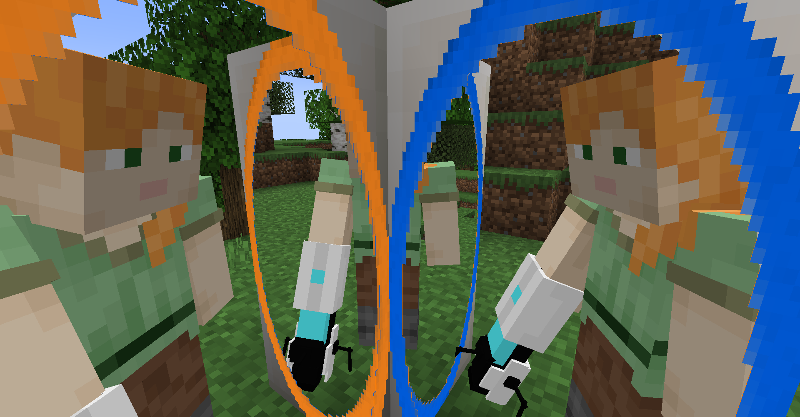
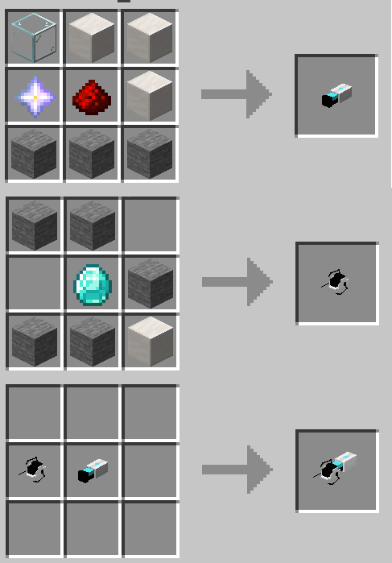

# Portal Gun

A Fabric mod that brings Portal Gun into Minecraft. [GitHub](https://github.com/iPortalTeam/PortalGun)

> It's based on the discontinued [MeowMC's portal gun mod](https://github.com/MeowMC/PortalGun)

[Download below](#download)

[Download from CurseForge](https://www.curseforge.com/minecraft/mc-mods/immersive-portal-gun)

### How to use

In creative mode, you can find the portal gun in "Tools and Utilities" tab.

In survival mode, the crafting recipe is:

Use left click to put blue portal, use right click to put orange portal. **The portal can link to any place in any dimension**. The portal gun can shoot through portals.

Each player's portal does not interfere with other players'.

#### Make the portal gun to only work on some blocks

By using commands, you can obtain a portal gun that only works on some blocks. For example, `/give @p portalgun:portal_gun{allowedBlocks:["#minecraft:ice","minecraft:stone"]} 1` gives a portal gun that only works on stone block and ice blocks (including ice, packed ice, blue ice and frosted ice). The `minecraft:stone` is the block id of stone. The `#minecraft:ice` refers to the `minecraft:ice` block tag.

## Download

Download from GitHub releases:

<ClientOnly>
<ModDownload
    github_repo="iPortalTeam/PortalGun"
    :locale_text="{download:'Download', preRelease:'Pre-Release', publishTime:'Publish time'}"></ModDownload></ClientOnly>